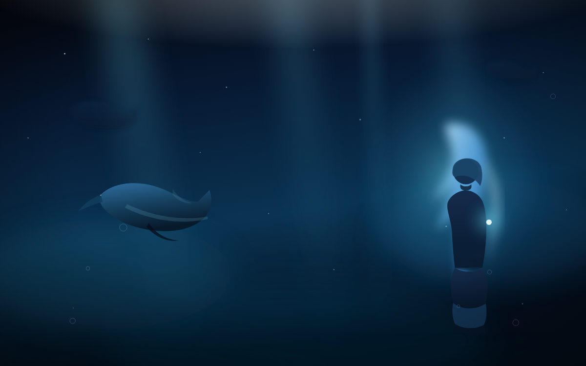
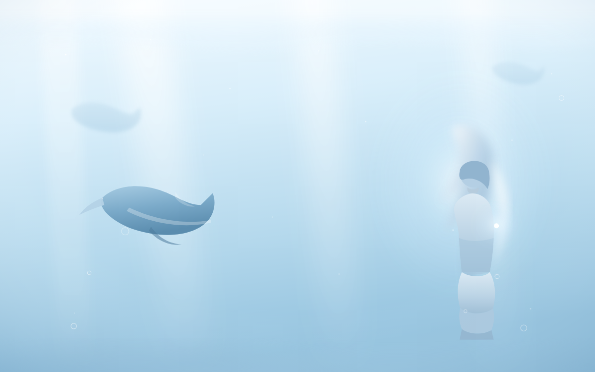

# 鲸鱼梦境 · dsh-blue-whale-fantasy

一个 DSH 皮肤插件：原创深海鲸鱼插画垫底 + 半透明玻璃面板，插画会从面板下方透出来。

做法上参考了皮肤中心里 `blue-fantasy`（蓝色幻想）与 `whale-fantasy` 的**设计思路**——
「插画垫底 + 半透明面板」这一手法，以及 v2 皮肤契约的用法。**插画与 CSS 全部为本项目原创**，
没有搬运原皮肤那张 CC BY-NC-SA 的 `whale-art.jpg`，因此本项目可以按 CC0 释出。

> 命名说明：GitHub 仓库叫 `dsh-blue-whale-fantasy`，而皮肤的 **id 是 `whale-dream`**。
> 两者刻意不同——`whale-fantasy` / `whale-maid` / `blue-fantasy` 等 id 已被皮肤中心占用，
> 皮肤 id 必须全局唯一，所以这里另取一个，不会和内置皮肤撞车。





| 主题 | 风格 |
| --- | --- |
| 暗色 | 深海墨蓝：逆光鲸影、四道光柱、上浮气泡，右侧背身浮游的鲸鱼少女与指尖微光 |
| 亮色 | 浅海珠白：水面波光、白色光柱、同一构图的浅色鲸影与少女 |

上面两张 `preview/*.png` 是**真实渲染**出来的（Edge 无头模式截图），不是占位图。

## 特性

- 声明式**纯资产**皮肤：不含任何可执行代码（刻意不做 `hooks.mjs`），
  全部视觉来自 `skin.css` + `patches.css` + `skin.json` 的 `backgroundMedia`
- 面板透明度**不写死**，由皮肤中心写在 `document.body` 上的 `--dsw-skin-scrim` 驱动
- 零运行时依赖，没有构建步骤——`skin-assets/` 就是最终产物
- 宿主半边幂等部署，且**永不覆盖你自己的改动**

## 安装

皮肤中心（`@linxin666/dsh-client-ui-skin-center`）是必需的渲染引擎——没有它，
没有任何东西会去读这份皮肤。

```sh
# 1) 渲染引擎（若尚未安装）
dsh plugin add @linxin666/dsh-client-ui-skin-center

# 2) 本插件
dsh plugin add github:<你的用户名>/dsh-blue-whale-fantasy

# 3) 重启 DSH（bundle 层在启动时装配）
```

然后打开 **设置 → 皮肤中心**，找到 **鲸鱼梦境**，点一下即时试穿、应用。
若界面没变化，先在应用窗口按 **Ctrl+Shift+R** 硬刷新（客户端 bundle 带 `immutable` 缓存）。

也可以本地安装：

```sh
dsh plugin add /path/to/dsh-blue-whale-fantasy
```

## 它是怎么工作的

皮肤中心发现皮肤只有两个来源：

1. **用户目录** `$DSH_HOME/skins/<id>/`（社区 / 本地放置的皮肤）
2. **内置目录** `<皮肤中心包>/skins/<id>/`

一个**独立插件**走不通第 2 条——皮肤中心不会去扫别人的 `node_modules`。所以本插件走第 1 条：

```
挂载时：skin-assets/  ──物化──▶  $DSH_HOME/skins/whale-dream/  ──发现──▶  皮肤中心
```

皮肤目录里的文件由皮肤中心自己通过 `/skins/<id>/asset/...` 伺服，
宿主半边**不注册任何路由**——再开一套只会变成第二个真相。

## 想改成自己的

### 换插画

直接编辑这两张 SVG，或用你自己的图替换：

- `skin-assets/assets/whale-dream-dark.svg`
- `skin-assets/assets/whale-dream-light.svg`

换成别的格式（jpg / png / webp）时，记得同步改 `skin-assets/skin.json` 里
`contributes.backgroundMedia.<theme>.src`。改完跑一次预览渲染：

```sh
node tools/render-previews.mjs
```

### 调面板的透明程度

```css
--dsw-alias-bg-layer-1: rgba(14, 31, 51, calc(1 - var(--dsw-skin-scrim, 0) * .74));
```

`* .74` 这个系数越大，面板越透、插画越明显；调小就更实、更利于阅读。
`skin.css` 里 `:root` 段是亮色，`body[data-ds-dark-theme]` 段是暗色。

### 改 CSS 前一定要知道的两条硬约定

- **不要自己写皮肤作用域。** 皮肤中心在服务端会给每条选择器强制加上
  `html[data-dsh-skin="whale-dream"]`；你自己再写一遍会变成双重嵌套，规则全部失效。
  写「裸」选择器就对了。
- **白名单是 fail-closed 的。** `@import`、远程 URL、以 `/` 开头的绝对路径、
  `../` 越界一律直接让整个样式表失败。资源只能放在皮肤目录里用相对路径引用。

`:root` / `html` 会被改写成作用域本身，`body` 会变成作用域的后代，
所以 `body[data-ds-dark-theme]` 这种写法可以照常用来分主题。

## 你的改动不会被覆盖

宿主半边的覆盖策略刻意做得保守：

| 情况 | 行为 |
| --- | --- |
| 目标已存在且与源逐字节一致 | 什么都不做 |
| 目标存在、内容有差异，但文件集一致 | 判定为**你自己改过**，保留现场并只打一条警告 |
| 目标里出现源里没有的文件 | 判定为旧版本残留，按文件更新，**你新增的文件一律不删** |
| 设了 `DSH_SKIN_WHALE_DREAM_FORCE=1` | 强制覆盖回插件自带版本 |

恢复出厂状态：

```sh
rm -rf ~/.dsh/skins/whale-dream   # 删掉改动，重启 DSH 让它重新物化
```

## 目录结构

```
dsh-blue-whale-fantasy/
├─ package.json            # dsh.bundle.patch 指向 cordis.patch.yml
├─ cordis.patch.yml        # 把宿主半边挂进 profile
├─ LICENSE                 # CC0 1.0
├─ lib/index.js            # 宿主半边：物化皮肤资产到 $DSH_HOME/skins
├─ skin-assets/            # 皮肤本体（会被完整复制到 $DSH_HOME/skins/whale-dream）
│  ├─ skin.json            # v2 manifest
│  ├─ skin.css             # L1 token 重映射 + 半透明层
│  ├─ patches.css          # L3 自由选择器（磨砂、边框微光、状态色）
│  ├─ assets/*.svg         # 原创插画（深浅两版）
│  └─ preview/*.png        # 真实渲染的预览图
└─ tools/
   ├─ render-previews.mjs          # 重新渲染预览图
   ├─ verify-offline.mjs           # 离线自检：契约 + 部署 + 幂等 + 覆盖保护
   ├─ verify-with-skin-center.mjs  # 用真实皮肤中心校验发现与校验结果
   ├─ verify-css-pipeline.mjs      # 用真实 CSS 管线校验白名单与作用域
   └─ preview-shot.html            # 渲染预览用的宿主页
```

## 校验

本项目不需要 `npm install` 就能跑校验。本机若没有全局 node，
可以用 DSH 环境里现成的运行时（例如 Playwright 附带的那份）：

```sh
NODE="/c/Users/Administrator/AppData/Local/Programs/Python/Python312/Lib/site-packages/playwright/driver/node.exe"

"$NODE" tools/verify-offline.mjs           # 离线自检（9 组断言）
"$NODE" tools/verify-with-skin-center.mjs  # 真实皮肤中心：能否被发现、有无诊断
"$NODE" tools/verify-css-pipeline.mjs      # 真实 CSS 管线：白名单 + 作用域
```

发布时的状态：三项全部通过，皮肤中心 **0 诊断、0 警告**，CSS 管线 **0 违规**。

## 已知限制

- **只支持有皮肤中心的 DSH**。没有皮肤中心时本插件不产生任何视觉效果
  （皮肤文件仍会被正常物化，只是没人去读）。
- 插画是**手写的 SVG 矢量图**，风格偏插画 / 剪影，不是精细写实美术。
- 亮色主题的对比度天然低于暗色主题：浅色插画 + 浅色面板的可读性余量较小，
  如果嫌面板太薄，把 `skin.css` 里亮色那组系数调大即可。

## 致谢与许可

- 设计思路受皮肤中心内置的 `blue-fantasy` / `whale-fantasy` 启发；
  本项目的插画与全部 CSS 为原创，未使用其美术资源。
- 本项目代码与美术以 **CC0 1.0** 释出，见 [LICENSE](LICENSE)，可自由使用、修改、商用。
